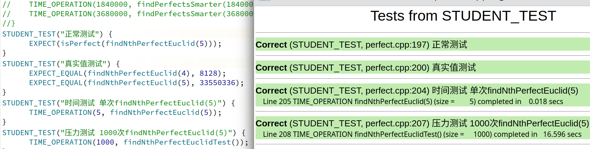

### 💡 Q1：该程序在你的电脑上执行了多久？共有多少个完全数，分别是哪些？
**<font size=4>A1.</font>**

```
6.8秒. 
四个完全数，分别为(6, 28, 496, 8128)
```


### 💡Q2. 在表格中记录findPerfects的执行时间

**<font size=4>A2.</font>**  


|  数据量  | 时间 |
| :--: | :--: |
| 15250 | 1.016 secs |
| 30500 | 3.818 secs |
| 61000 | 14.904 secs |
| 122000 | 59.460 secs |


### 💡Q3. 对于 10 与 1000，计算 isPerfect是否做了同样多的工作？为什么一样多，或者为什么不一样多？对于搜索范围为 1-1000 的数，findPerfect其工作量是否与 1000-2000 时一致？为什么一样多，或者为什么不一样多？

**<font size=5>A3.</font>**

```
isPerfect－－从实现的功能出发做了一样的工作，都是求先求一个数　除自身外所有因数的和，然后再判断这个数是否是完全数，所以工作量一样
＊　　　　　 　从求因数的过程出发过程，较大的数因数相对较多，所以过程略慢一些．只是这个过程很快，基本上时间差距很小，因此都显示为0.000 secs．
Ps:若将第二个数改为100000则isPerfect的时间也会出现一定的差距

findPerfect－－以数据范围为500和1500为例可以看出　500时　findPerfect用时0.017 secs
＊　　　　　　　　　　　　　　　　　　　　　　　    1500时　findPerfect用时0.040 secs
显然，对于findPerfect来说是要求一定范围内，每一个数是否是完全数．因此，当范围更大时，后面每一个数的因数更多．而求因数的过程累计到一起，造成了1500时求完全数更慢.
```


### 💡Q4. 根据你收集到的数据进行推测：找出第五个数 findPerfect 要花费多少时间？

**<font size=5>A4.</font>**  
由第２问可知，当数据范围翻倍时，用时变为全来的4倍．则
```
(33550336) / 122000 / 2 * ( 59.46 * 4 ) ≈ 32703 secs
```


### 💡Q5. 这个函数测试失败时，其他测试是否还能通过？为什么？

**<font size=4>A5.（不理解这里的测试是要测试什么，猜测是PROVIDED_TEST？）</font>**　

若total为0，则


若toal为1，则

```
显然此时，由于total加了1，因数之和出现了偏差．因此，除了第三行的测试外，其他的测试全部出现了错误
```


### 💡Q6. 描述一下你的测试策略。

**<font size=4>A6.</font>**  

```
测试方法主要通过EXPECT_EQUAL判断原生的divisorSum函数和自己写的smarterSum函数求到的因数之和是否相等
```


smarterSum代码如下:
```
long smarterSum(long n) {
    long total = 1;
    long divisorSmall;
    for (divisorSmall = 2; divisorSmall < sqrt(n); divisorSmall++) {
        if (n % divisorSmall == 0) {
            long  divisorBig = n / divisorSmall;
            total += (divisorSmall + divisorBig);
        }
    }
    //if sqrt(n) is divisor, add it to the total
    if (n % divisorSmall == 0){
        total += divisorSmall;
    }
    return total;
}
```
### 💡Q7.  在表格中记录findPerfectsSmarter的执行时间。
**<font size=4>A7.</font>**  

|  数据量  | findPerfectsSmarter时间 |
| :--: | :--: |
| 460000 | 2.822 |
| 920000 | 7.296 |
| 840000 | 20.572 |
| 3680000 | 58.116 |

可以看出，相同时间内，findPerfectsSmarter可检索的数据范围显著上升

  
**<font size=5>isPerfectSmarter代码如下:</font>**  

```
bool isPerfectSmarter(long n) {
    return (n != 0) && (n == smarterSum(n));
}
```
**<font size=5>findPerfectsSmarter代码如下:</font>**  
```
void findPerfectsSmarter(long stop) {
    for (long num = 1; num < stop; num++) {
        if (isPerfectSmarter(num)) {
            cout << "Found perfect number: " << num << endl;
        }
        if (num % 10000 == 0) cout << "." << flush; // progress bar
    }
    cout << endl << "Done searching up to " << stop << endl;
}
```


### 💡Q8. 推测：findPerfectsSmarter 找到第 5 个完全数需要多久？

**<font size=4>A8.</font>**  
当数据范围翻倍时，用时变为全来的2√2倍则
```
(33550336) / 3680000 / 2 * ( 58.116 * 2√2 ) ≈ 749 secs
```


### 💡Q9. 阐述下你选择的测试案例的动机，解释下为什么你认为这几个测试可以确定函数 findNthPerfectEuclid 正常工作。

**<font size=4>A9.</font>**

正常测试－－通过现有的　完全数判断函数，确定findNthPerfectEuclid函数能否返回正确的值  
真实值测试－－通过已知的完全数再一次判断，findNthPerfectEuclid函数工作是否正常  
时间测试－－确定findNthPerfectEuclid函数的工作效率  
压力测试－－多次调用findNthPerfectEuclid函数确定其重复工作时的效率

**<font size=5>findNthPerfectEuclid代码如下:</font>** 
```
long findNthPerfectEuclid(long n) {
    long k = 1, m = 0 , perfectNum = 0 , count = 0;
    while(count != n){
        m = pow(2, k) - 1;
        if(smarterSum(m) == 1 && m != 1){
            perfectNum = pow(2, k - 1) * (pow(2, k) - 1);
            cout << "Found perfect number: " << perfectNum << endl;
            count++;
        }
        k++;
    }
    cout << endl << "Done searching up to " << n << endl;
    return perfectNum;
}
```
