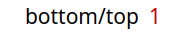
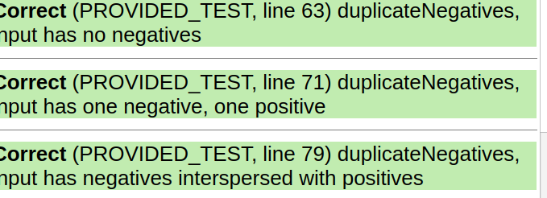
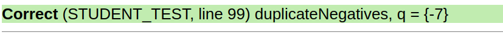
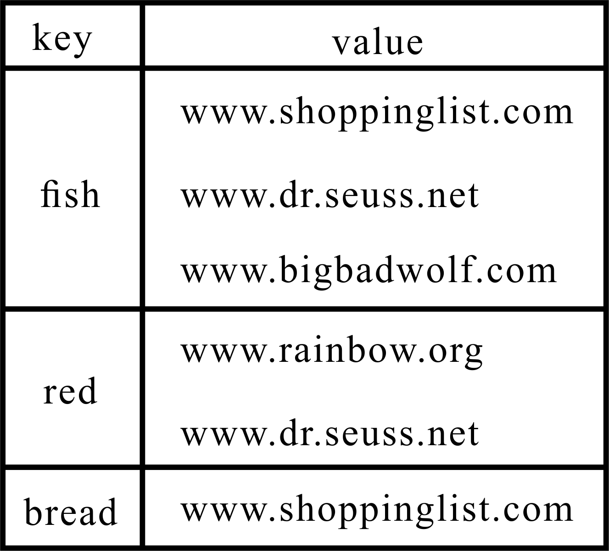
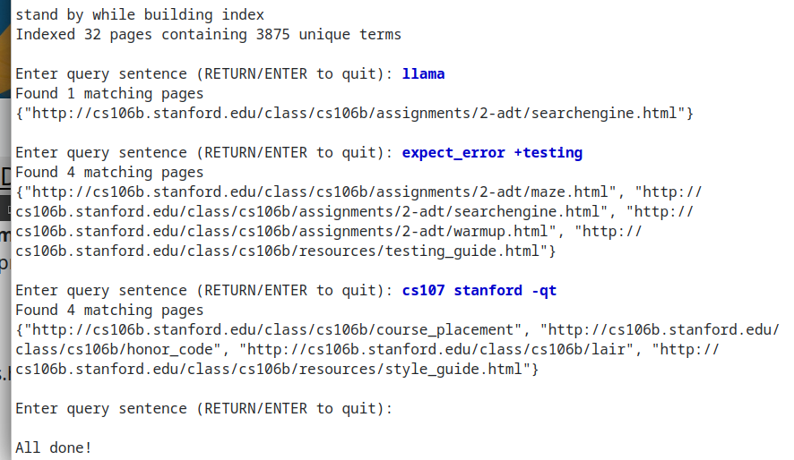

### 💡Q1：在调试变量面板中，Stack 使用 top 和 bottom 标签标记栈的两端。那么当 Stack 仅包含一个元素时，这两个标签将如何显示？
**<font size=4>A1.</font>**  


### 💡Q2：具体是什么情况，会造成函数无限循环执行？
**<font size=4>A2.</font>**  
```
只要队列q中全部为负数,函数就无限循环
```
### 💡Q3：解释下你编辑过的代码是如何修复 duplicateNegatives 中的问题的。
**<font size=4>A3.</font>**  
通过q = {-7, 9}的断点调试发现，循环并没有在两次后结束．很显然这一行代码中q.size()是变化的，这造成了循环没有正常地终止．
```c++
for (int i = 0; i < q.size(); i++)
```
将代码进行修改
```c++
void duplicateNegatives(Queue<int>& q) {
    int n = q.size();
    for (int i = 0; i < n; i++) {
        int val = q.dequeue();
        q.enqueue(val);
        if (val < 0) {
            q.enqueue(val);   // double up on negative numbers
        }
    }
}
```
修改后测试都能通过  



### 💡Q4：思考下如何更好的修复 sumStack 中的 bug？
**<font size=4>A4.</font>**  
删掉循环外的pop,并给total初始化为0即可避免空栈的pop操作
```c++
int sumStack(Stack<int> s) {
    int total = 0;
    while (!s.isEmpty()) {
        total += s.pop();
    }
    return total;
}
```
### 💡Q5：讲义中提到，以引用的方式来传递比较大的数据结构是更有效率的方式。那么，为什么在函数中validatePath，传递参数path时采用的是传值而不是传递引用呢？
**<font size=4>A5.</font>**  
```
因为在函数ｖalidatePath中，需要对path进行出栈的操作来验证是否有效．如果引用则会对路径造成修改
```
### 💡Q6：写完测试后，描述下你的测试策略是如何确保 validatePath 正确工作的。
**<font size=4>A6.</font>**  
```
首先通过有效的路径确认validatePath函数不会报错
随后，测试了5种不同错误的路径以确保validatePath函数能正确地报错
5种不同错误的路径：１.路径不从左上角开始
                2.路径末端不在迷宫右下角
                3.路径穿过墙壁
                4.路径有间断
                5.路径有重复的部分
```
### 💡Q7：根据 res/tiny.txt 数据库，画出反向索引数据结构的内容。
**<font size=4>A7.</font>**  


### 💡补充１：searchEngine运行截图
**<font size=4>补充１.</font>**  
