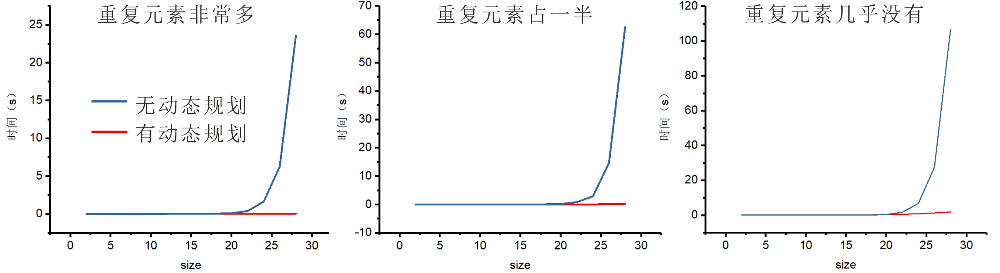

### 💡Q16. 在 hanoiAnimation 中越过 moveTower 调用之后，talMoves 的值是什么？

```
total：15
```
### 💡Q17. 在 Step Over 第一个递归子调用之后，totalMoves 变量的值是什么？（换句话说，在 else 语句中，只要 Step Over 第一个递归子调用 moveTower就可以执行 moveTower)
 
```
total：7
```
### 💡Q18. 在 moveTower 的 Base Case 满足时选择 Step Out，你最终会在哪里结束？（你在哪个函数中，行号是多少？）此时，totalMoves 变量的值是多少？
```
moveTower中
第67行
totalMove:1
```

### 💡Q19. 你用来触发程序错误的最小可能输入是什么？
```
Vector<int> v = {1};
```
### 💡Q20. 识别代码中的单字符错误，并解释为什么单字符错误会导致上述测试案例中的错误返回结果。你应该能够具体说明错误是如何导致结果从“完全正确”变为“严重错误”的。
```c++
buggyCount(v, index + 1, sumSoFar += v[index])
这一段代码改变了sumSoFar的值，这使得另一个分支递归的函数中sumSoFar的值不再是上一个level的值
```

### 💡Q21. 函数 computePowerIndex 的大 O 是多少？包括你的计时数据并解释它如何支持你的推理。
```
无动态规划:　Ｏ(2^n)       
有动态规划:　Ｏ(n)
```

|  数据量  |有动态规划|有动态规划|有动态规划|无动态规划|无动态规划|无动态规划|
|  :--:   |  :--:  |  :--:  |  :--:  |  :--:  |  :--:  |  :--:  |
|  　　　　 |重复非常多|重复占一半|几乎无重复|重复非常多|重复占一半|几乎无重复|
|2	      |0	   |0	    |0	     |0	      |0	   |0       |
|4	      |0.001   |0	    |0	     |0	      |0	   |0       |
|6	      |0	   |0.001	|0	     |0	      |0	   |0       |
|8	      |0	   |0	    |0.001	 |0	      |0	   |0       |
|10	      |0.001   |0.001   |0.008	 |0	      |0	   |0       |
|12	      |0.001   |0.002   |0.019	 |0.001   |0	   |0.001   |
|14	      |0.002   |0.003   |0.046	 |0.002	  |0.002   |0.004   |
|16	      |0.003   |0.005   |0.095	 |0.006	  |0.01	   |0.017   |
|18	      |0.005   |0.012   |0.179	 |0.026	  |0.043   |0.083   |
|20	      |0.007   |0.022   |0.328	 |0.101	  |0.157   |0.369   |
|22	      |0.01    |0.026   |0.517	 |0.381	  |0.819   |1.669   |
|24	      |0.008   |0.05    |0.826	 |1.616	  |2.862   |6.721   |
|26	      |0.01    |0.074   |1.24	 |6.261	  |14.642  |27.568  |
|28	      |0.017   |0.083   |1.806	 |23.556  |62.56   |106.6   |
### 💡Q22. 使用大 O 和计时数据来估计计算美国选举团中 51 个投票区的影响力指数需要多长时间。
```
无动态规划:　3.14e22秒       
有动态规划:　30秒　
```
