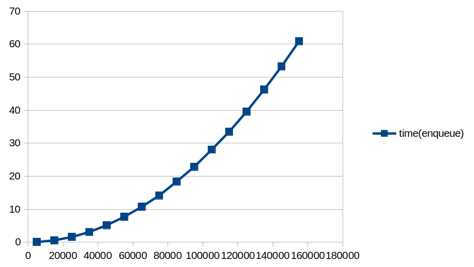
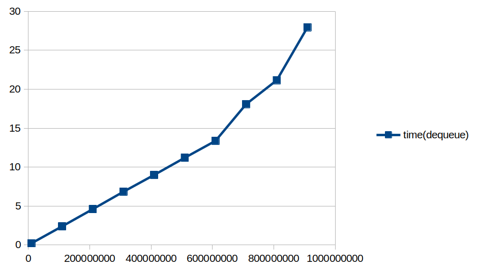
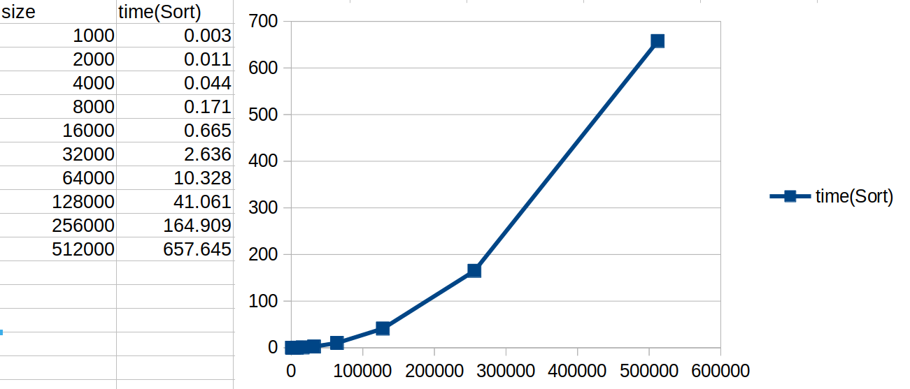
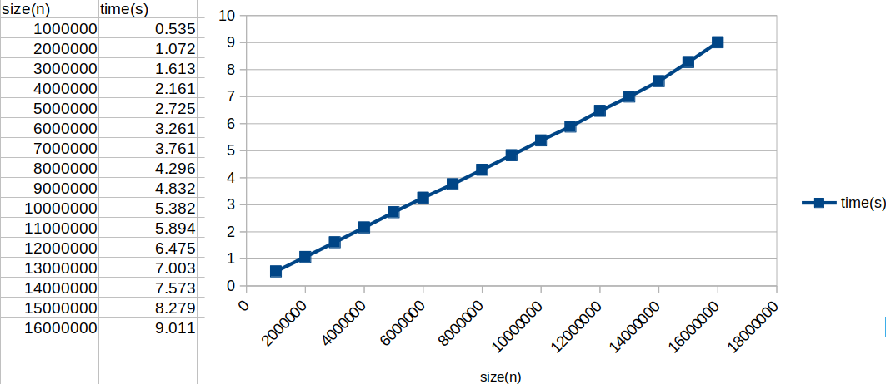
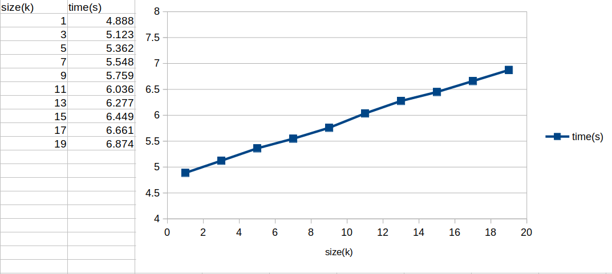
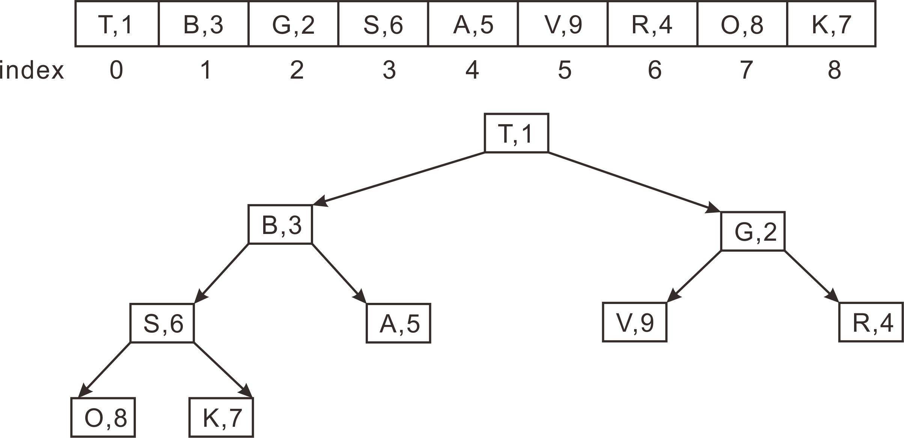
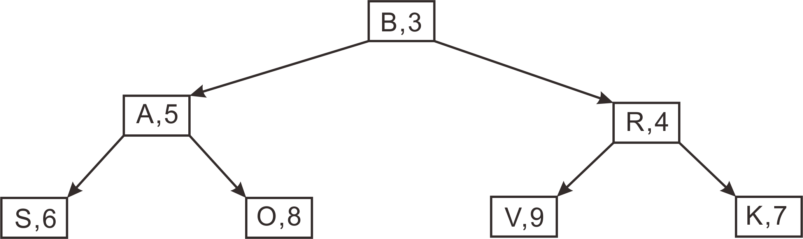

### 💡Q1. allBalls[0] 成员变量的值如何在迭代中变化？具体来说，_id、_x 和 _y 的值会发生什么？
```
_id不变
_x在每次迭代中 + _vx
_y在每次迭代中 + _vy
```
### 💡Q2. 在不断的迭代中，卡住的球的成员变量是如何变化的？跟上一个问题的答案做个比较。
```c++
小球卡在了下面．此时_vy绝对值不变，但其正负号在每次迭代中不断切换．
这使得_y不断的加上和减去一个固定的值，所以小球始终卡在下边界．

原因是初始化位置超过边界太多．尽管在界外会改变速度方向，
但在一个迭代步之内还是没回到界内，这使得速度不断变化，始终回不来．

bug原因:
_x = randomInteger(0, _window->getWidth());
_y = randomInteger(0, _window->getHeight());
初始化小球位置时没有考虑小球大小
```
### 💡Q3. 强制把卡住的球放置到 (0, 0) 位置会恢复正常吗？还是仍然卡住？
```
恢复正常，不会卡住．
```

### 💡Q4. 在你的系统上，这些内存错误的观察结果是什么：
- 访问分配的数组边界之外的索引？
```
Exception (PROVIDED_TEST, line 44) Test case that access indexes beyond array bounds
    Test failed due to the program triggering an exception.
     
    This means that the test did not fail because of a call
    to EXPECT() or an EXPECT_ERROR() failing, but rather because
    some code - probably an internal C++ library - triggered
    an error.
     
    Error: basic_string::_M_create
```
- 两次删除相同的内存？
```
*** STANFORD C++ LIBRARY
*** The PQueue program has terminated unexpectedly (crashed)
*** A segmentation fault (SIGSEGV) occurred during program execution

    This error indicates your program attempted to dereference a pointer
    to an invalid memory address (possibly out of bounds, deallocated, nullptr, ...)

*** To get more information about a program crash,
*** run your program again under the debugger.

FATAL: exception not rethrown
```
- 删除后访问内存？
```
*** STANFORD C++ LIBRARY
*** The PQueue program has terminated unexpectedly (crashed)
*** A segmentation fault (SIGSEGV) occurred during program execution

    This error indicates your program attempted to dereference a pointer
    to an invalid memory address (possibly out of bounds, deallocated, nullptr, ...)

*** To get more information about a program crash,
*** run your program again under the debugger.

FATAL: exception not rethrown
```
### 💡Q5. 接口 (pqarray.h) 和实现 (pqarray.cpp) 中都有大量注释。解释接口中的注释与实现中的注释为什么不同。考虑下文档的内容和受众。
```c++
pqarray.h: (面向user) 更像是说明书，简要地指出类有什么成员变量，有什么成员函数，各自的功能和返回值是什么
pqarray.cpp：(面向developer) 更像是详细图纸，包含了每个成员函数的具体实现代码．
```

### 💡Q6. 该类声明了成员变量 _numAllocated 和 _numFilled。这两个计数有什么区别，为什么都需要？
```
_numAllocated:关系到数组需要分配的内存空间      
_numFilled:关系到数组中有实际元素传入的个数
```

### 💡Q7. 尽管成员函数体内的代码可以直接访问对象的成员变量，但实现者可以选择调用公共成员函数来获取有关对象的信息。例如，请注意操作 isEmpty() 和 peek() 为何故意调用 size() 而不是使用 _numFilled 或者 dequeue() 为何调用  peek() 来检索最前面的元素。为什么这样的写法，被认为是更好的设计？
```
1.接口在程序设计时是需要保持稳定的，而成员变量可能发生变化
2.减少直接操作成员变 量的函数的个数，安全性更好
3.降低函数实现的复杂度
```

### 💡Q8. 给出你的时间试验的结果，并解释它们如何支持你对入队和出队的 Big-O 运行时的预测。
```
enqueue:Ｏ(n) -　时间随数据量线性增长
dequeue:Ｏ(1) - 达到很大的数据量时，时间才开始线性增长
```



### 💡Q9. 基于入队/出队的大 O，如果基于 PQArray 实现，对 pqSort 的大 O 做一个预测？运行一些计时测试以确认你的预测，并将该数据包含在你的答案中。
```
Ｏ(n^2) 随着数据规模的增加，时间呈指数增长（数据规模翻倍，用时翻4~5倍）
```

### 💡Q10. 基于入队/出队的大 O，如果使用 PQArray，你对 topK 的大 O 的 k 和 n 有什么期望？运行一些计时试验以确认你的预测，并将该数据包含在你的答案中。
```
topK - Ｏ(kn) 用时与k和n都呈线性关系
```



### 💡Q11. 从一个空的二叉堆开始，按如下所示的顺序将九个数据点排入队列并显示结果。你只需要显示最终堆，而不是中间步骤。将堆绘制为树状图，根元素在顶部，两个子元素在下面，依此类推。

### 💡Q12. 在上面的二叉堆上进行两次出队调用并绘制更新的结果。

### 💡Q13. 画出上面二叉堆的数组表示。用数组索引标记每个元素。
