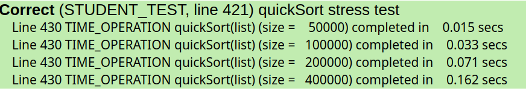
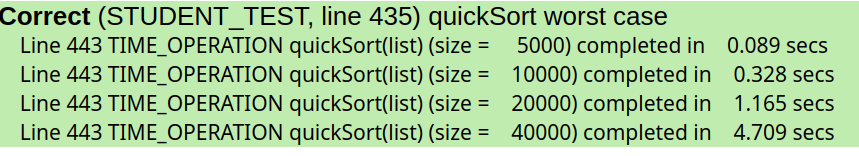
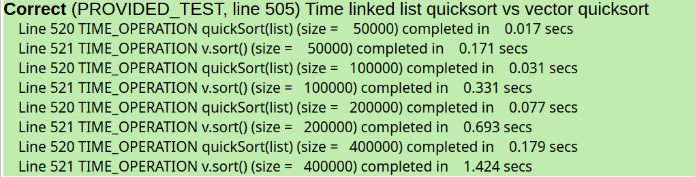

### 💡Q1. 测试用例的黄色背景在 SimpleTest 结果窗口中表示什么？
```
存在内存泄漏
```
### 💡Q2. 对已释放的内存地址使用 delete 的测试结果是什么？
```
内存错误
```
### 💡Q3. 在你的系统上，观察到 badDeallocate 的后果是什么？错误代码在什么情况下（如果有）触发了错误或崩溃？
```
badDeallocate导致了内存错误，其过程如下：
１．建立了链表后，调用badDeallocate函数第一次delete后，data和next都变为了垃圾值
２．将垃圾值的next地址赋值给list指针
３．在下一个循环delete 垃圾地址的内容时出现了内存错误（根本没有开辟这个内存空间存放任何值）
```

### 💡Q4. 你的系统上如何呈现段错误？
```
*** STANFORD C++ LIBRARY
*** The Lists program has terminated unexpectedly (crashed)
*** A segmentation fault (SIGSEGV) occurred during program execution

    This error indicates your program attempted to dereference a pointer
    to an invalid memory address (possibly out of bounds, deallocated, nullptr, ...)

*** To get more information about a program crash,
*** run your program again under the debugger.

FATAL: exception not rethrown
```
### 💡Q5. 你能想出其他收集所需物品的路径嘛？
```
WNNWEWNNEESNWSWWN
```
### 💡Q6. 如果 deallocateList 函数是递归实现的，请粗略估计它可以成功处理的最大长度列表。对于比最大值更长的列表，如果尝试收回内存，观察到的结果是什么？（提示：请参考你在作业 3 中的热身练习）
```
而每一个链表单元由其本身地址（8字节）＋　int data（4字节）＋ next指针(8字节)构成
所以最大列表长度为 (内存大小) / 20  
如：64G内存 　为　68719476736字节 / 20　＝　34359738368个
如果超过这个值，发生内存错误　　
```
### 💡Q7. sort 函数的原型通过引用获取 ListNode*。解释为什么指针本身需要通过引用传递，如果不这样做会产生什么后果。
```c++
因为需要修改的是指针而不是指针指向的对象，不用引用的话，在函数内会创建一个局部指针来复制这个指针.
这样即使对这个局部指针的地址进行修改，但输入的指针地址并没有起到修改的效果.
```

### 💡Q8. 运行时间测试并提供确认 QuickSort 为 O(NlogN) 的结果。构建触发最坏情况的输入，验证运行时间降级到 O(N^2)。
Ｏ(NlogN)结果

```
当输入序列为正序或者逆序时，每一次三分的时候，left或right那边的大小只减小１，此时时间复杂度为Ｏ(N^2)
```
Ｏ(N^2)结果


### 💡Q9. 运行提供的计时试验，将你的链表快速排序与相同序列上的向量排序进行比较并报告结果。谁赢了，为什么？
```
链表更快，因为直接操作指针，避免了解引用和交换数据的操作
```
对比结果

