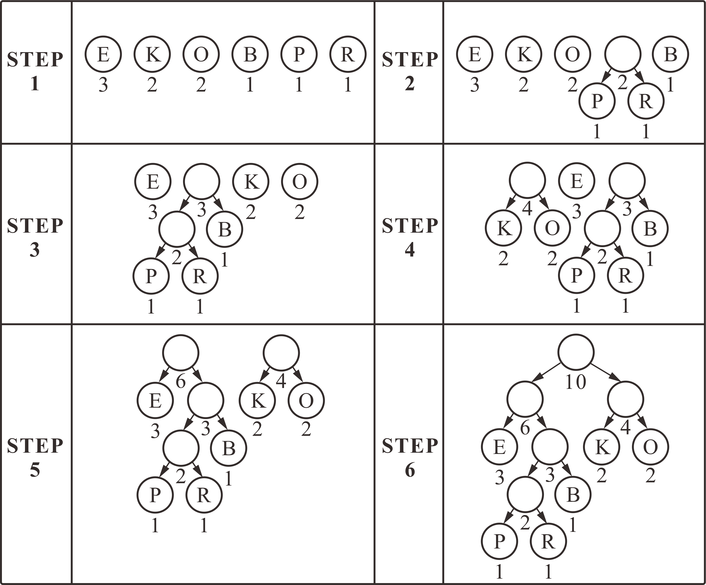

### 💡 Q1. 使用上面的编码树对序列 0101100011 进行解码。
```
0101100011　－　MOONS
```

### 💡Q2. 为上述编码树制作一个表格，列出每个字符及其分配的位序列。使用表格对字符串“SONS”进行编码。
```
011100011　－　SONS
```
|  字符  | 位序列 |
| :--: | :--: |
| N | 00 |
| M | 010 |
| S | 011 |
| O | 1 |

### 💡Q3. 哈夫曼代码遵循前缀属性（Prefix-Free）：任意字符的编码位序列都不是其他字符的前缀。编码树的什么特征表明它服从前缀属性？
```
哈夫曼树只在叶节点上有字符，所以能保证前缀的位序列不重复
```
### 💡Q4. 将右上方的编码树展平为位序列和字符序列。
```
位序列:1101000
字符序列:NMSO
```
### 💡Q5. 展开序列 110100100 和 FLERA 以重建原始编码树。
<center><font color="#6A5ACD">*</font></center>
<center>/　　\</center>
<center><font color="#1E90FF">*　　　</font><font color="#696969">*</font></center>
<center>/　\　　/　\</center>
<center><font color="#006600">　F　　</font><font color="#FFA500">*　</font><font color="#808000">R　 </font><font color="#800000">A　</font><center>
<center>　/　\　　</center>
<center><font color="#B8860B">　L　　</font><font color="#FF0000">E　　</font>

### 💡Q6. 为输入“BOOKKEEPER”构造哈夫曼编码树。

```
位序列:11011000100
字符序列:EPRBKO
```

### 💡Q7. 哈夫曼编码树中的节点有两类，两个非空子节点或没有子节点。为什么哈夫曼树中的节点只有一个非空子节点没有意义？
```
因为哈夫曼树构造时是取优先队列中的两个元素合并到一个父节点上，因此，每个父节点必定有两个子节点
```

